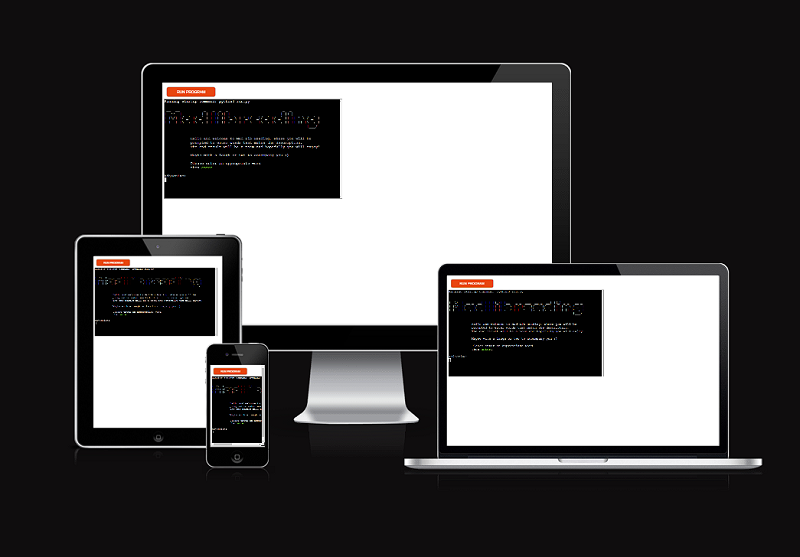
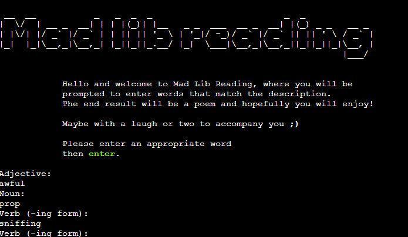
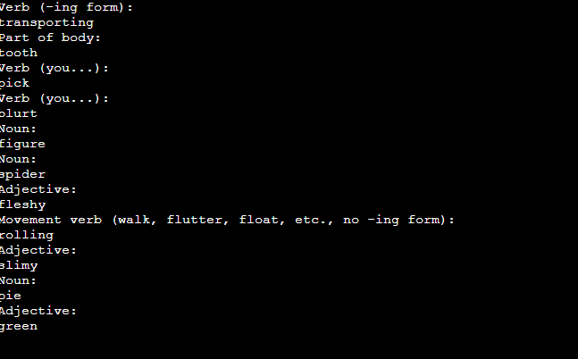
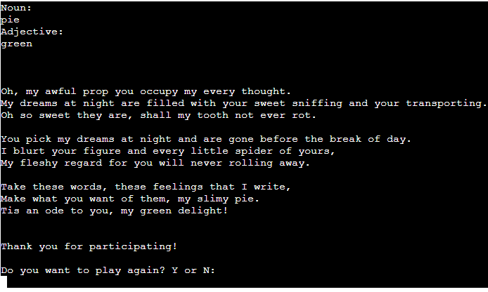

# Mad Lib Reading
This project is inspired by previous games I have played and enjoy, where you write words which will be put into a story or a text. This can sometimes have a very bizarre but still fun result, which is why I went for the idea.  
This project prompts the player to write appropriate words which will finally be put into a short poem, written by me.  

[Live version of Mad Lib Reading](https://mad-lib-reading.herokuapp.com/)

## Features

### Existing Features
- User input
  - Player will get a type of word which they will write in the terminal and then press enter  

  
- Specification of grammar on some input  
  - user input is stored for use in template  

  
- template file grab
  - template is grabbed from external file
  - user input is put in template
  - template is run and displayed with user input  

- User asked whether they want to play again  

### Future Features
- Additional templates that the user can choose from
- Specify grammar for input  

## Testing
I have manually tested the project by:
- Passed code through PEP8 and confirmed that no problems arose.
- Checked for redundant code and spelling errors
- Tested project in local terminal and Heroku terminal.  

### Bugs

#### Solved Bugs
- Added the whole game in a loop to allow for the player to choose if they want to play again.  

### Remaining Bugs
- No input validation except for 'N' if player is asked to play again.  

### Validator Testing
- PEP8
  - No errors resturned from [PEP8online](http://pep8online.com/)  

## Deployment
Mad Lib Reading was deployed using Code Institute's moch terminal for Heroku.  
  
- Steps for deployment:
  - Create a new Heroku app
  - Add PORT 8000 to a Config Var
  - Add buildbacks  
    1 heroku/python  
    2 heroku/nodejs  
  - Link repository to Heroku
  - Click Deploy
## Credits
- Code institute for the deployment terminal
- [Kevin Fortier](https://www.youtube.com/watch?v=vFNZvZSOqlY&ab_channel=KevinFortier) for his very detailed and good tutorial/guide which showed me exactly what and how to do what I wanted to give me the result I wanted.